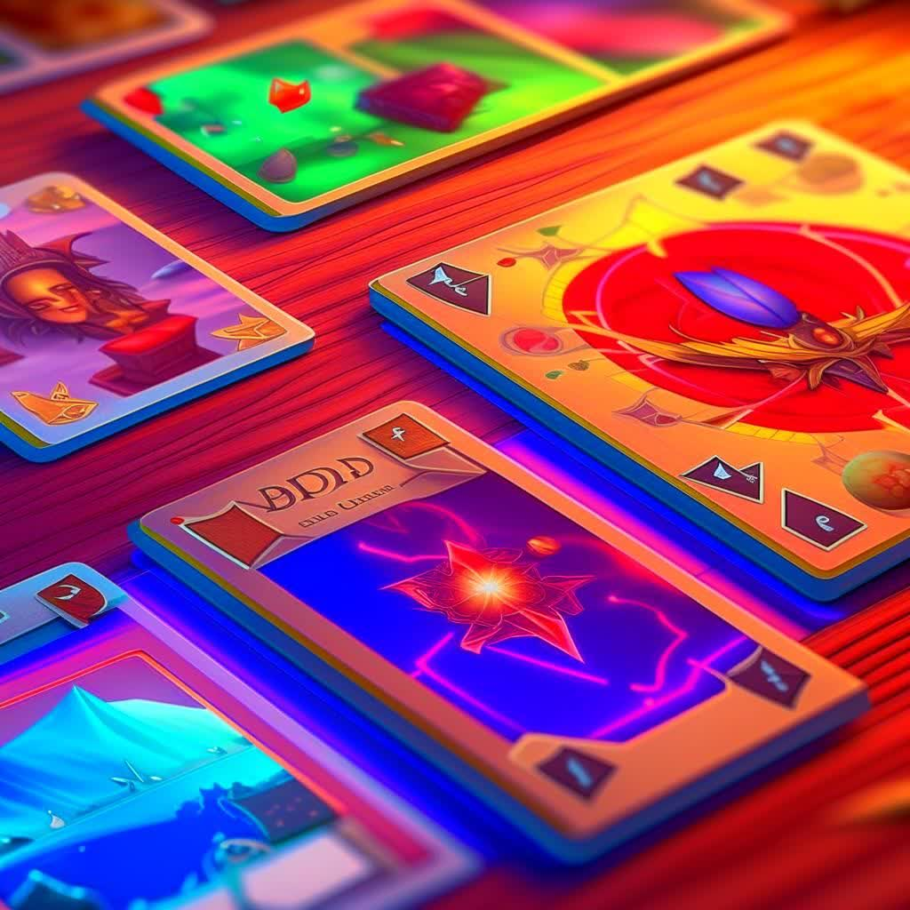
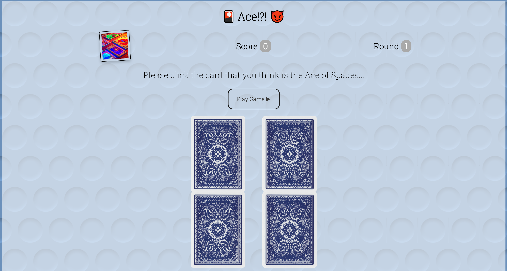

<h1>OX Duel card</h1>

This project is an interactive card game built using JavaScript, along with HTML and CSS for the game's layout and styling respectively. The game offers players a fun and engaging experience, leveraging the power of modern web technologies to create a seamless and enjoyable gaming experience.
This JavaScript-based card game allows players to compete in a digital environment
 

## Installation
1. Clone the repository: `git clone https://github.com/seyed0123/OXDuelCards.git`
2. Navigate to the project directory: `cd OXDuelCards`

## Usage
Open `index.html` in your browser to start the game.

## Technologies Used
The game is built using the following technologies:
- JavaScript: The core game logic is written in JavaScript.
- HTML: The game layout and structure are created using HTML.
- CSS: The game's styling and animations are implemented using CSS.

## License
This project is licensed under the terms of the MIT license.

## Screenshots and Demos

### demo
wait for it

